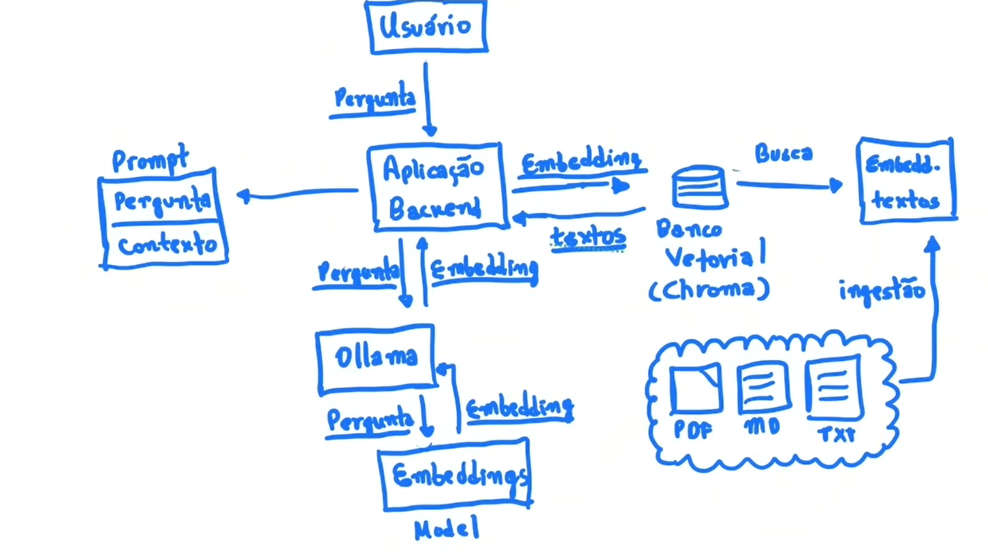

# RAG Local Demo

Este repositório foi criado [nesse vídeo](https://youtu.be/j0CdfesdRZQ) e rodando **100% local**, com foco em **arquitetura, dados e decisões de design**, não apenas em frameworks.

A ideia é mostrar como uma aplicação RAG funciona **de ponta a ponta**:
- Ingestão de documentos
- Busca semântica
- Uso de contexto
- Geração de respostas com LLM local

A documentação de referência pode ser encontrada [aqui](https://giulianabezerra.notion.site/RAG-Local-Demo-2cf49c5a6df18010bbf3e32b1505fc10).

## 🎥 Sobre o vídeo

No vídeo, a construção da aplicação segue esta ordem:

1. Arquitetura e componentes
2. Fluxo de dados
3. Implementação prática
4. Discussão dos modos de funcionamento do RAG (restrito vs híbrido)

O código aqui serve como **apoio ao raciocínio arquitetural** apresentado.

## 🏷️ Estrutura de versões (tags)

O repositório possui duas versões principais:

### 🔹 `initial`
Versão inicial para acompanhar o vídeo passo a passo, contendo:

- Estrutura de pastas
- Arquivos Python vazios ou com TODOs
- Dependências definidas

👉 Ideal para quem quer **construir junto**.

### 🔹 `complete`
Versão final com a aplicação totalmente funcional, contendo:

- Ingestão de documentos
- Banco vetorial
- API de perguntas
- Exemplos de documentos

👉 Ideal como **referência** ou para quem quer testar direto.


## 📁 Estrutura do projeto

```text
rag-local/
 ├── app/
 │   ├── main.py        # API (FastAPI)
 │   ├── ingest.py      # Ingestão e indexação
 │   └── rag.py         # Lógica de RAG
 ├── data/
 │   └── docs/          # Documentos de exemplo (PDF, txt, md)
 ├── chroma/            # Banco vetorial (gerado localmente)
 ├── requirements.txt
 └── README.md
```

⚠️ A pasta chroma/ não deve ser versionada. Ela é criada automaticamente ao rodar a ingestão.

## ⚙️ Pré-requisitos

- Python 3.10+
- Git
- [Ollama](https://ollama.com/download) instalado e rodando localmente:
```sh
# Instruções para MAC
brew install ollama
ollama serve
```
- Modelos instalados
```sh
ollama pull mistral
ollama pull nomic-embed-text
```

## 🤖 Modelos utilizados

- LLM local: mistral
- Embeddings: nomic-embed-text

Os modelos são gerenciados pelo Ollama.

## 🚀 Como executar

1.  Clonar o repositório na branch initial
```
git clone https://github.com/ -b initial
cd rag-local-demo
```

2. Criar ambiente virtual
```
python3 -m venv .venv
source .venv/bin/activate
```

3. Instalar dependências
```
pip install -r requirements.txt
```

4. Rodar a ingestão
```
python app/ingest.py
```

5. Subir a API
```
uvicorn app.main:app --reload
```

6. Fazer uma pergunta
```
curl -X POST http://localhost:8000/pergunta \
  -H "Content-Type: application/json" \
  -d '{"question": "O que é arquitetura de dados?"}'
```

## 🧠 Observações importantes

- O LLM não acessa dados diretamente
- Todo acesso a documentos passa pelo banco vetorial
- O comportamento do RAG depende das decisões arquiteturais
- Frameworks são substituíveis, o raciocínio não

## 📌 Objetivo educacional
Este projeto não é um produto pronto, mas um exemplo didático para discutir:
- Arquitetura de IA
- Governança
- Trade-offs de uso de LLMs
- RAG em ambientes controlados

## 📜 Licença
Uso educacional e demonstrativo.

## Arquitetura
